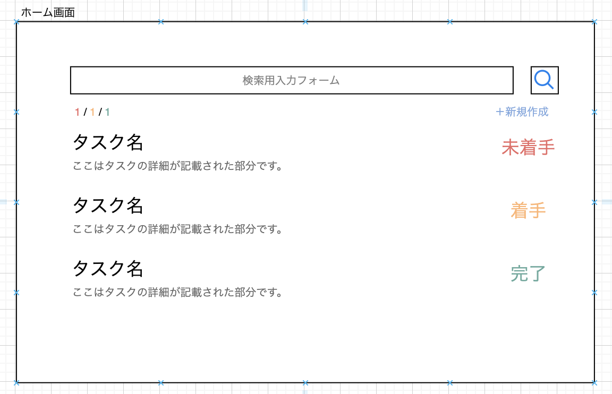
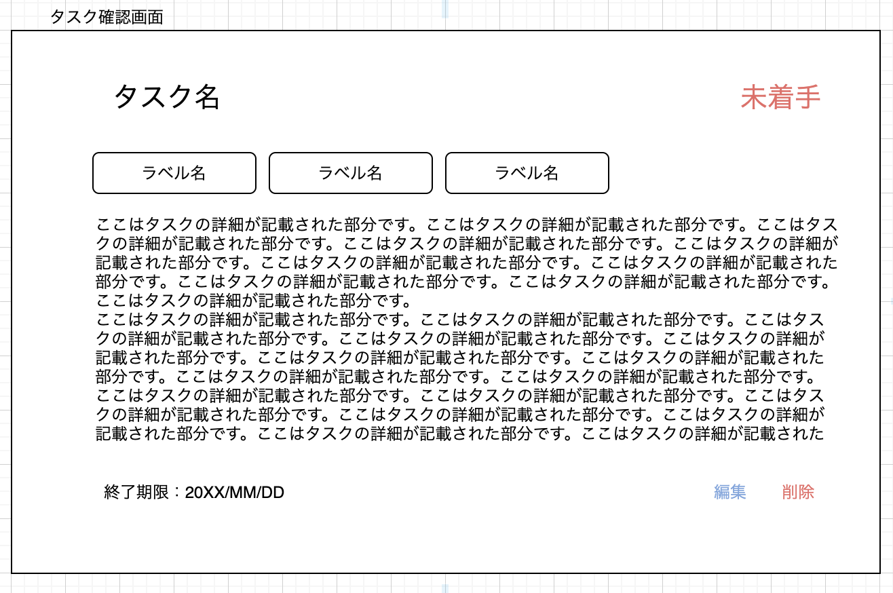
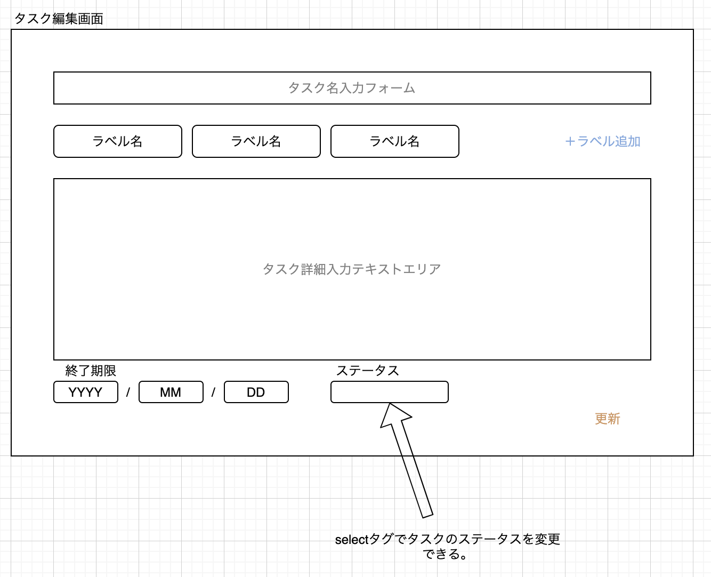
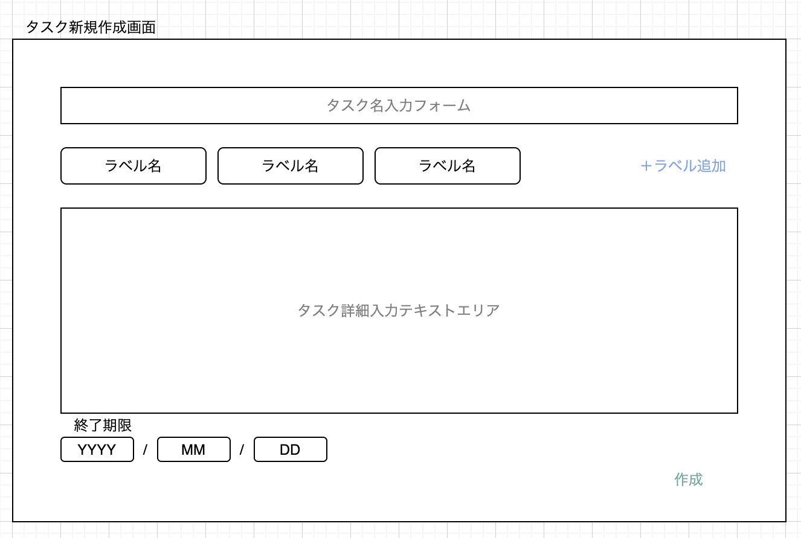
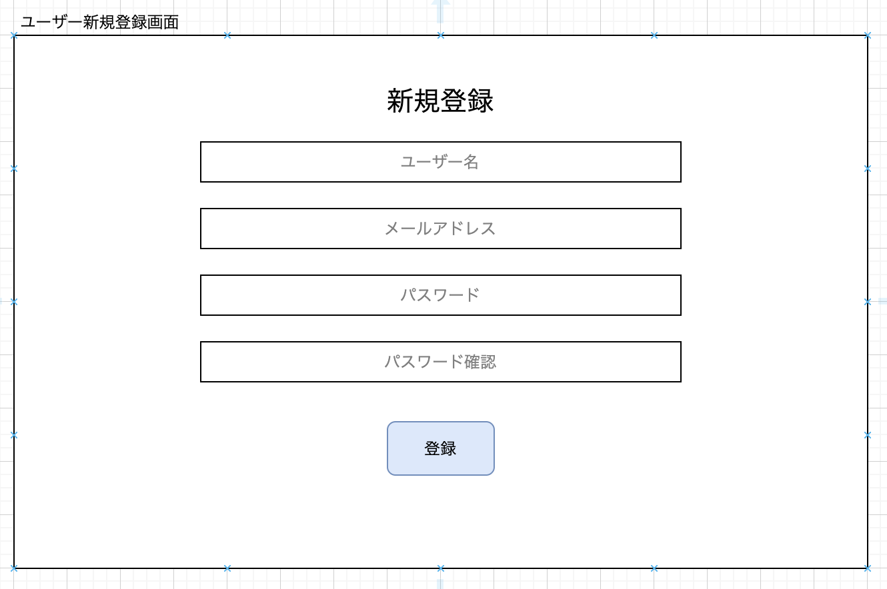
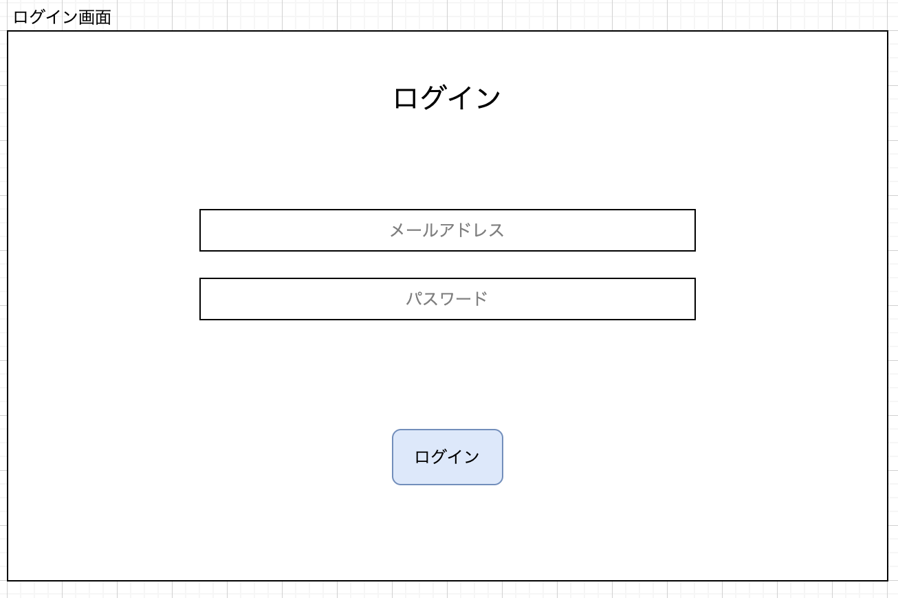
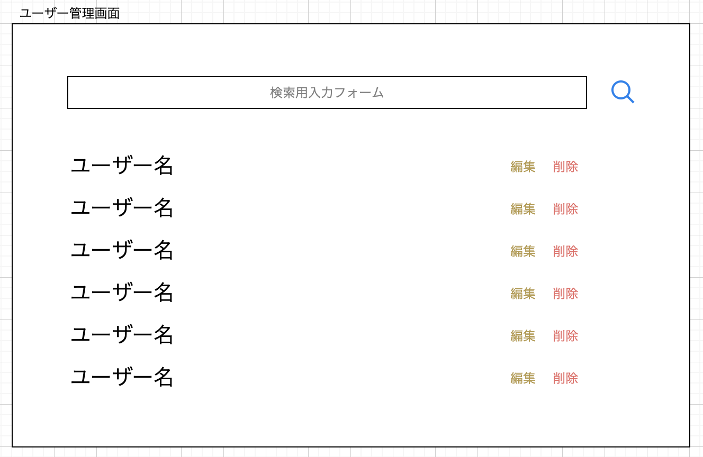
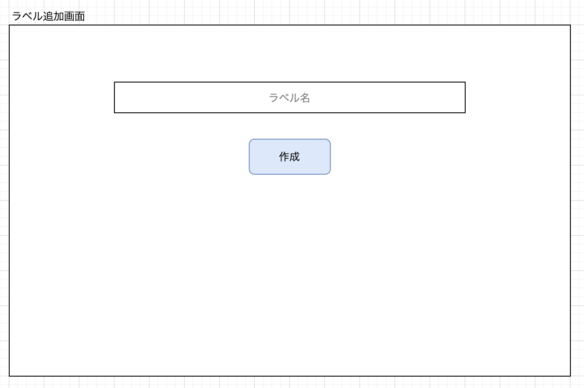
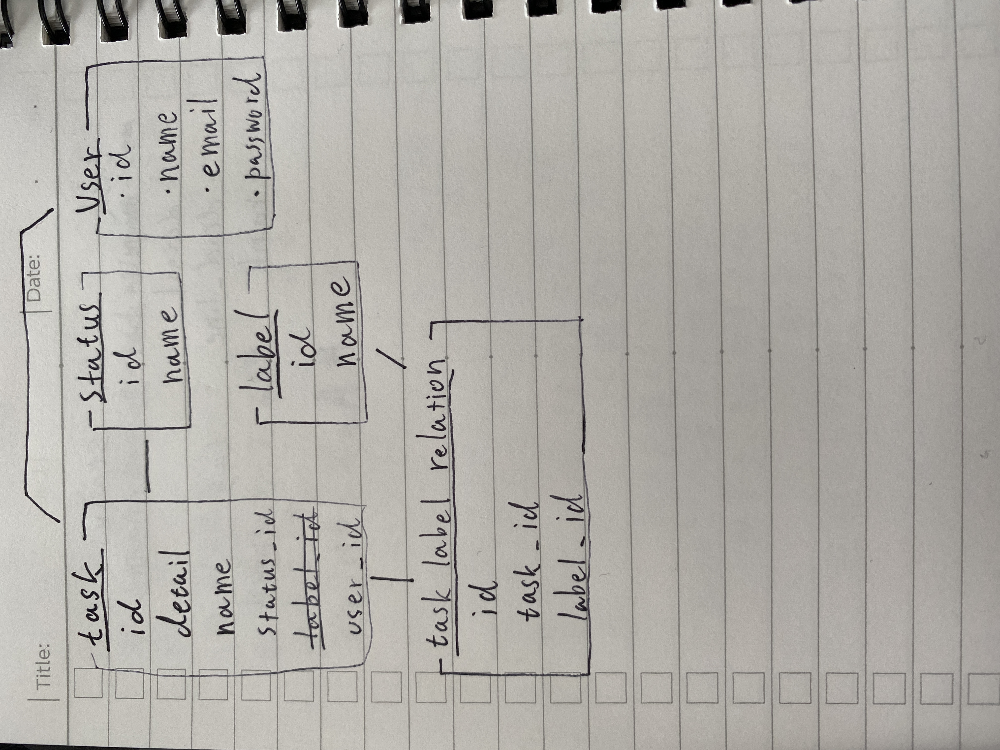

# このアプリケーションについて
## 画面設計

Googleドライブより

https://drive.google.com/file/d/1vYhzFwIWhX5mseK_ycKz6x7JzyQhElJJ/view?usp=sharing
## モデル図

## デプロイ方法
アクセスは[こちら(todo-list)](https://todolist-curriculum.herokuapp.com/)

### 準備
 - heroku.ymlを追加
   - 外部に公開しても問題ない環境変数はここで定義する。
   - `RAILS_LOG_TO_STDOUT=true`はherokuのログが詳細になるため設定しておくべき。
 - Dockerfileに`CMD`を追記
 - herokuのsettingから環境変数にrailのシークレットキーを定義
 - config/environment/production
   - `config.public_file_server.enabled = true`を設定
   - `config.assets.compile = true`を設定（パフォーマンス的には適切ではないが、利便性のため設定しておくと無難だと思われる。）
